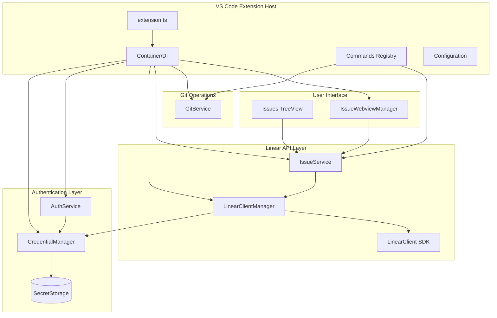

# Linear Studio - VS Code Extension Plan

A TypeScript VS Code extension that brings Linear issue management into your IDE, modeled after Atlassian's atlascode architecture.

## Architecture Overview



> **Note on Linear Terminology:** Linear uses "Workspaces" (the organization level) containing multiple "Teams". When users refer to filtering by "workspace", this typically means filtering by Team in Linear's API.

## Project Structure

```
linear-studio/
├── src/
│   ├── extension.ts              # Extension entry point
│   ├── container.ts              # Dependency injection container
│   ├── constants.ts              # Commands, config keys, view IDs
│   ├── auth/
│   │   ├── authService.ts        # API key authentication
│   │   └── credentialManager.ts  # VS Code SecretStorage wrapper
│   ├── linear/
│   │   ├── linearClientManager.ts # LinearClient lifecycle
│   │   ├── issueService.ts       # Issue fetching, filtering, caching
│   │   └── types.ts              # DTOs and shared types
│   ├── views/
│   │   ├── issues/
│   │   │   ├── issuesTreeProvider.ts
│   │   │   ├── nodes/
│   │   │   │   ├── issueNode.ts
│   │   │   │   ├── cycleNode.ts
│   │   │   │   └── projectNode.ts
│   │   │   └── index.ts
│   │   └── issueWebview/
│   │       ├── issueWebviewManager.ts  # Singleton manager for webview panels
│   │       └── issueWebviewController.ts
│   ├── commands/
│   │   ├── index.ts              # Command registration
│   │   └── startWorkCommand.ts   # Start work & create branch
│   ├── git/
│   │   └── gitService.ts         # Branch creation
│   └── types/
│       └── git.d.ts              # VS Code Git extension API types
│
├── webview-ui/                   # React webview (separate build)
│   ├── src/
│   │   ├── App.tsx
│   │   ├── components/
│   │   │   ├── IssueHeader.tsx
│   │   │   ├── IssueDescription.tsx
│   │   │   ├── CommentList.tsx
│   │   │   └── Sidebar.tsx
│   │   ├── hooks/
│   │   │   └── useVSCodeApi.ts
│   │   └── index.tsx
│   ├── package.json
│   ├── tsconfig.json
│   └── vite.config.ts            # Vite bundler for webview
│
├── images/
│   └── icon.png                  # Extension icon (128x128)
│
├── package.json                  # Extension manifest
├── tsconfig.json
├── esbuild.js                    # Extension build script
├── .vscodeignore
└── .gitignore
```

---

## High-Level Code Examples

### 1. Extension Entry Point (`src/extension.ts`)

Following VS Code best practices, the extension activates and initializes the Container:

```typescript
import * as vscode from 'vscode';
import { Container } from './container';
import { registerCommands } from './commands';

export async function activate(context: vscode.ExtensionContext) {
    // Initialize dependency injection container
    await Container.initialize(context);
    
    // Register all commands
    registerCommands(context);
    
    // Set context for conditional UI
    await vscode.commands.executeCommand(
        'setContext', 
        'linear-studio.authenticated', 
        Container.authService.isAuthenticated
    );
}

export function deactivate() {
    Container.dispose();
}
```

---

### 2. Container Pattern (`src/container.ts`)

Static service locator pattern (matching atlascode's architecture):

```typescript
import * as vscode from 'vscode';
import { AuthService } from './auth/authService';
import { CredentialManager } from './auth/credentialManager';
import { LinearClientManager } from './linear/linearClientManager';
import { IssueService } from './linear/issueService';
import { IssuesTreeProvider } from './views/issues/issuesTreeProvider';
import { IssueWebviewManager } from './views/issueWebview/issueWebviewManager';
import { GitService } from './git/gitService';

export class Container {
    private static _context: vscode.ExtensionContext;
    private static _credentialManager: CredentialManager;
    private static _authService: AuthService;
    private static _linearClientManager: LinearClientManager;
    private static _issueService: IssueService;
    private static _issuesTreeProvider: IssuesTreeProvider;
    private static _issueWebviewManager: IssueWebviewManager;
    private static _gitService: GitService;
    
    static async initialize(context: vscode.ExtensionContext): Promise<void> {
        this._context = context;
        
        // Core services - CredentialManager first
        this._credentialManager = new CredentialManager(context.secrets);
        this._authService = new AuthService(this._credentialManager);
        
        // Initialize auth state from stored credentials
        await this._authService.initialize();
        
        // Linear API layer - uses CredentialManager directly
        this._linearClientManager = new LinearClientManager(this._credentialManager);
        this._issueService = new IssueService(this._linearClientManager);
        
        // Git operations
        this._gitService = new GitService();
        
        // Webview manager (singleton for issue panels)
        this._issueWebviewManager = new IssueWebviewManager(
            context.extensionUri,
            this._issueService
        );
        
        // Views - register tree view
        this._issuesTreeProvider = new IssuesTreeProvider(this._issueService);
        const treeView = vscode.window.createTreeView('linearStudio.issues', {
            treeDataProvider: this._issuesTreeProvider,
            showCollapseAll: true,
        });
        context.subscriptions.push(treeView);
        
        // Listen for auth changes to refresh views and reset client
        this._authService.onDidChangeAuthentication(async (isAuthenticated) => {
            this._linearClientManager.reset();
            this._issuesTreeProvider.refresh();
            
            // Update VS Code context for conditional UI
            await vscode.commands.executeCommand(
                'setContext',
                'linear-studio.authenticated',
                isAuthenticated
            );
        });
    }
    
    // Static getters for service access (like atlascode pattern)
    static get context(): vscode.ExtensionContext { return this._context; }
    static get credentialManager(): CredentialManager { return this._credentialManager; }
    static get authService(): AuthService { return this._authService; }
    static get linearClientManager(): LinearClientManager { return this._linearClientManager; }
    static get issueService(): IssueService { return this._issueService; }
    static get issuesTree(): IssuesTreeProvider { return this._issuesTreeProvider; }
    static get issueWebviewManager(): IssueWebviewManager { return this._issueWebviewManager; }
    static get gitService(): GitService { return this._gitService; }
    
    static dispose(): void {
        this._issueWebviewManager?.dispose();
    }
}
```

---

### 3. Credential Manager (`src/auth/credentialManager.ts`)

Secure storage using VS Code's SecretStorage API:

```typescript
import * as vscode from 'vscode';

const API_KEY_SECRET = 'linear-studio.apiKey';

export class CredentialManager {
    constructor(private readonly secrets: vscode.SecretStorage) {}
    
    async getApiKey(): Promise<string | undefined> {
        return this.secrets.get(API_KEY_SECRET);
    }
    
    async setApiKey(apiKey: string): Promise<void> {
        await this.secrets.store(API_KEY_SECRET, apiKey);
    }
    
    async deleteApiKey(): Promise<void> {
        await this.secrets.delete(API_KEY_SECRET);
    }
}
```

---

### 4. Auth Service (`src/auth/authService.ts`)

Authentication management with event emission:

```typescript
import * as vscode from 'vscode';
import { LinearClient } from '@linear/sdk';
import { CredentialManager } from './credentialManager';

export class AuthService {
    private _onDidChangeAuthentication = new vscode.EventEmitter<boolean>();
    readonly onDidChangeAuthentication = this._onDidChangeAuthentication.event;
    
    private _isAuthenticated = false;
    private _currentUser: { id: string; name: string; email: string } | undefined;
    
    constructor(private readonly credentialManager: CredentialManager) {}
    
    get isAuthenticated(): boolean {
        return this._isAuthenticated;
    }
    
    get currentUser() {
        return this._currentUser;
    }
    
    /**
     * Initialize auth state from stored credentials on extension startup
     */
    async initialize(): Promise<void> {
        const apiKey = await this.credentialManager.getApiKey();
        if (apiKey) {
            try {
                // Validate stored key is still valid
                const client = new LinearClient({ apiKey });
                const viewer = await client.viewer;
                this._currentUser = {
                    id: viewer.id,
                    name: viewer.name,
                    email: viewer.email,
                };
                this._isAuthenticated = true;
            } catch {
                // Stored key is invalid, clear it
                await this.credentialManager.deleteApiKey();
                this._isAuthenticated = false;
            }
        }
    }
    
    async authenticate(): Promise<boolean> {
        const apiKey = await vscode.window.showInputBox({
            prompt: 'Enter your Linear API Key',
            password: true,
            placeHolder: 'lin_api_...',
            ignoreFocusOut: true,
            validateInput: (value) => {
                if (!value) {
                    return 'API key is required';
                }
                if (!value.startsWith('lin_api_')) {
                    return 'API key should start with lin_api_';
                }
                return undefined; // Valid
            }
        });
        
        if (!apiKey) return false;
        
        // Validate the API key by making a test request
        try {
            const client = new LinearClient({ apiKey });
            const viewer = await client.viewer;
            
            await this.credentialManager.setApiKey(apiKey);
            this._currentUser = {
                id: viewer.id,
                name: viewer.name,
                email: viewer.email,
            };
            this._isAuthenticated = true;
            this._onDidChangeAuthentication.fire(true);
            
            vscode.window.showInformationMessage(
                `Authenticated as ${viewer.name} (${viewer.email})`
            );
            return true;
        } catch (error) {
            vscode.window.showErrorMessage(
                'Invalid API key. Please check your key and try again.'
            );
            return false;
        }
    }
    
    async logout(): Promise<void> {
        await this.credentialManager.deleteApiKey();
        this._currentUser = undefined;
        this._isAuthenticated = false;
        this._onDidChangeAuthentication.fire(false);
        vscode.window.showInformationMessage('Logged out from Linear');
    }
}
```

---

### 5. Linear Client Manager (`src/linear/linearClientManager.ts`)

Lazy initialization of LinearClient with proper error handling:

```typescript
import { LinearClient } from '@linear/sdk';
import { CredentialManager } from '../auth/credentialManager';

export class LinearClientManager {
    private _client: LinearClient | undefined;
    
    constructor(private readonly credentialManager: CredentialManager) {}
    
    /**
     * Get or create a LinearClient instance.
     * Throws if not authenticated.
     */
    async getClient(): Promise<LinearClient> {
        if (!this._client) {
            const apiKey = await this.credentialManager.getApiKey();
            if (!apiKey) {
                throw new Error('Not authenticated. Please authenticate with Linear first.');
            }
            this._client = new LinearClient({ apiKey });
        }
        return this._client;
    }
    
    /**
     * Check if we have stored credentials (doesn't validate them)
     */
    async hasCredentials(): Promise<boolean> {
        const apiKey = await this.credentialManager.getApiKey();
        return !!apiKey;
    }
    
    /**
     * Reset the client instance (call after logout or auth change)
     */
    reset(): void {
        this._client = undefined;
    }
}
```

---

### 6. Issue Service (`src/linear/issueService.ts`)

Core service for fetching and filtering issues. Uses DTOs to avoid issues with Linear SDK class instances:

```typescript
import { Issue, Cycle, Project, Comment, WorkflowState } from '@linear/sdk';
import { LinearClientManager } from './linearClientManager';
import { IssueDTO, IssueDetailsDTO, CommentDTO } from './types';

export interface IssueFilter {
    cycleId?: string;
    projectId?: string;
    teamId?: string;  // Note: Linear "team" = what users often call "workspace"
}

export class IssueService {
    // Simple in-memory cache
    private _issueCache = new Map<string, { data: IssueDTO[]; timestamp: number }>();
    private readonly CACHE_TTL_MS = 60_000; // 1 minute
    
    constructor(private readonly clientManager: LinearClientManager) {}
    
    /**
     * Fetch all issues assigned to the current user
     * Uses viewer.assignedIssues() from Linear SDK
     */
    async getMyAssignedIssues(filter?: IssueFilter): Promise<IssueDTO[]> {
        const cacheKey = JSON.stringify(filter || {});
        const cached = this._issueCache.get(cacheKey);
        
        if (cached && Date.now() - cached.timestamp < this.CACHE_TTL_MS) {
            return cached.data;
        }
        
        const client = await this.clientManager.getClient();
        const me = await client.viewer;
        
        let issuesConnection = await me.assignedIssues({
            first: 50,
            filter: {
                cycle: filter?.cycleId ? { id: { eq: filter.cycleId } } : undefined,
                project: filter?.projectId ? { id: { eq: filter.projectId } } : undefined,
                team: filter?.teamId ? { id: { eq: filter.teamId } } : undefined,
            }
        });
        
        const issues: Issue[] = [...issuesConnection.nodes];
        
        // Handle pagination - fetch all pages
        while (issuesConnection.pageInfo.hasNextPage) {
            issuesConnection = await issuesConnection.fetchNext();
            // Only add new nodes (fetchNext appends to existing nodes)
            const newNodes = issuesConnection.nodes.slice(issues.length);
            issues.push(...newNodes);
        }
        
        // Convert to DTOs
        const issueDTOs = await Promise.all(issues.map(i => this.toIssueDTO(i)));
        
        this._issueCache.set(cacheKey, { data: issueDTOs, timestamp: Date.now() });
        return issueDTOs;
    }
    
    /**
     * Fetch issue with full details including comments
     */
    async getIssueWithComments(issueId: string): Promise<IssueDetailsDTO> {
        const client = await this.clientManager.getClient();
        const issue = await client.issue(issueId);
        
        let commentsConnection = await issue.comments({ first: 50 });
        const comments: Comment[] = [...commentsConnection.nodes];
        
        // Handle pagination correctly
        while (commentsConnection.pageInfo.hasNextPage) {
            commentsConnection = await commentsConnection.fetchNext();
            const newComments = commentsConnection.nodes.slice(comments.length);
            comments.push(...newComments);
        }
        
        return this.toIssueDetailsDTO(issue, comments);
    }
    
    /**
     * Get cycles for filtering dropdown
     */
    async getActiveCycles(): Promise<Array<{ id: string; name: string; startsAt?: Date; endsAt?: Date }>> {
        const client = await this.clientManager.getClient();
        const cyclesConnection = await client.cycles({
            filter: { isActive: { eq: true } }
        });
        return cyclesConnection.nodes.map(c => ({
            id: c.id,
            name: c.name || `Cycle ${c.number}`,
            startsAt: c.startsAt,
            endsAt: c.endsAt,
        }));
    }
    
    /**
     * Get projects for filtering dropdown
     */
    async getProjects(): Promise<Array<{ id: string; name: string }>> {
        const client = await this.clientManager.getClient();
        const projectsConnection = await client.projects({ first: 100 });
        return projectsConnection.nodes.map(p => ({ id: p.id, name: p.name }));
    }
    
    /**
     * Get the branch name for an issue (provided by Linear)
     */
    async getBranchName(issueId: string): Promise<string> {
        const client = await this.clientManager.getClient();
        const issue = await client.issue(issueId);
        return issue.branchName;
    }
    
    /**
     * Clear cache (call on refresh)
     */
    clearCache(): void {
        this._issueCache.clear();
    }
    
    // ─── DTO Converters ────────────────────────────────────────────
    
    private async toIssueDTO(issue: Issue): Promise<IssueDTO> {
        const [state, cycle, project, assignee, labels] = await Promise.all([
            issue.state,
            issue.cycle,
            issue.project,
            issue.assignee,
            issue.labels(),
        ]);
        
        return {
            id: issue.id,
            identifier: issue.identifier,
            title: issue.title,
            description: issue.description,
            priority: issue.priority,
            priorityLabel: issue.priorityLabel,
            url: issue.url,
            branchName: issue.branchName,
            state: state ? { 
                id: state.id, 
                name: state.name, 
                type: state.type,
                color: state.color,
            } : undefined,
            cycle: cycle ? { 
                id: cycle.id, 
                name: cycle.name || `Cycle ${cycle.number}`,
                startsAt: cycle.startsAt?.toISOString(),
                endsAt: cycle.endsAt?.toISOString(),
            } : undefined,
            project: project ? { id: project.id, name: project.name } : undefined,
            assignee: assignee ? { 
                id: assignee.id, 
                name: assignee.name,
                email: assignee.email,
                avatarUrl: assignee.avatarUrl,
            } : undefined,
            labels: labels.nodes.map(l => ({ 
                id: l.id, 
                name: l.name, 
                color: l.color,
            })),
            createdAt: issue.createdAt.toISOString(),
            updatedAt: issue.updatedAt.toISOString(),
        };
    }
    
    private async toIssueDetailsDTO(issue: Issue, comments: Comment[]): Promise<IssueDetailsDTO> {
        const issueDTO = await this.toIssueDTO(issue);
        
        const commentDTOs: CommentDTO[] = await Promise.all(
            comments.map(async (c) => {
                const user = await c.user;
                return {
                    id: c.id,
                    body: c.body,
                    createdAt: c.createdAt.toISOString(),
                    user: user ? {
                        id: user.id,
                        name: user.name,
                        avatarUrl: user.avatarUrl,
                    } : undefined,
                };
            })
        );
        
        return {
            ...issueDTO,
            comments: commentDTOs,
        };
    }
}
```

### 6b. Types (`src/linear/types.ts`)

DTOs to safely transfer data between extension and webview:

```typescript
// Issue DTO for tree view and basic display
export interface IssueDTO {
    id: string;
    identifier: string;      // e.g., "ENG-123"
    title: string;
    description?: string;
    priority: number;
    priorityLabel: string;
    url: string;
    branchName: string;
    state?: {
        id: string;
        name: string;
        type: string;        // 'backlog' | 'unstarted' | 'started' | 'completed' | 'canceled'
        color: string;
    };
    cycle?: {
        id: string;
        name: string;
        startsAt?: string;
        endsAt?: string;
    };
    project?: {
        id: string;
        name: string;
    };
    assignee?: {
        id: string;
        name: string;
        email: string;
        avatarUrl?: string;
    };
    labels: Array<{
        id: string;
        name: string;
        color: string;
    }>;
    createdAt: string;
    updatedAt: string;
}

// Extended DTO with comments for detail view
export interface IssueDetailsDTO extends IssueDTO {
    comments: CommentDTO[];
}

export interface CommentDTO {
    id: string;
    body: string;
    createdAt: string;
    user?: {
        id: string;
        name: string;
        avatarUrl?: string;
    };
}
```

---

### 7. Issues Tree View Provider (`src/views/issues/issuesTreeProvider.ts`)

Following atlascode's JiraIssueNode pattern with EventEmitter refresh. Uses DTOs for clean data handling:

```typescript
import * as vscode from 'vscode';
import { IssueService, IssueFilter } from '../../linear/issueService';
import { IssueDTO } from '../../linear/types';
import { Commands } from '../../constants';

type TreeNode = CycleNode | IssueNode;

export class IssuesTreeProvider implements vscode.TreeDataProvider<TreeNode> {
    // EventEmitter pattern for refresh (like atlascode)
    private _onDidChangeTreeData = new vscode.EventEmitter<TreeNode | undefined>();
    readonly onDidChangeTreeData = this._onDidChangeTreeData.event;
    
    private _filter: IssueFilter = {};
    private _isLoading = false;
    
    constructor(private readonly issueService: IssueService) {}
    
    refresh(clearCache = false): void {
        if (clearCache) {
            this.issueService.clearCache();
        }
        this._onDidChangeTreeData.fire(undefined);
    }
    
    setFilter(filter: IssueFilter): void {
        this._filter = filter;
        this.refresh(true);
    }
    
    async getChildren(element?: TreeNode): Promise<TreeNode[]> {
        if (!element) {
            // Root level: fetch and group issues
            this._isLoading = true;
            try {
                const issues = await this.issueService.getMyAssignedIssues(this._filter);
                this._isLoading = false;
                
                if (issues.length === 0) {
                    return []; // Empty state handled by viewsWelcome
                }
                
                return this.groupIssuesByCycle(issues);
            } catch (error) {
                this._isLoading = false;
                const message = error instanceof Error ? error.message : 'Unknown error';
                vscode.window.showErrorMessage(`Failed to fetch issues: ${message}`);
                return [];
            }
        }
        
        if (element instanceof CycleNode) {
            return element.children;
        }
        
        return [];
    }
    
    getTreeItem(element: TreeNode): vscode.TreeItem {
        return element;
    }
    
    private groupIssuesByCycle(issues: IssueDTO[]): TreeNode[] {
        const cycleMap = new Map<string, { name: string; dateRange?: string; issues: IssueDTO[] }>();
        const noCycle: IssueDTO[] = [];
        
        for (const issue of issues) {
            if (issue.cycle) {
                const existing = cycleMap.get(issue.cycle.id);
                if (existing) {
                    existing.issues.push(issue);
                } else {
                    cycleMap.set(issue.cycle.id, {
                        name: issue.cycle.name,
                        dateRange: this.formatDateRange(issue.cycle.startsAt, issue.cycle.endsAt),
                        issues: [issue],
                    });
                }
            } else {
                noCycle.push(issue);
            }
        }
        
        const nodes: TreeNode[] = [];
        
        // Active cycles first, sorted by name
        const sortedCycles = [...cycleMap.entries()].sort((a, b) => 
            a[1].name.localeCompare(b[1].name)
        );
        
        for (const [cycleId, { name, dateRange, issues: cycleIssues }] of sortedCycles) {
            const issueNodes = cycleIssues.map(i => new IssueNode(i));
            nodes.push(new CycleNode(cycleId, name, dateRange, issueNodes));
        }
        
        // Backlog/No Cycle at the end
        if (noCycle.length > 0) {
            const issueNodes = noCycle.map(i => new IssueNode(i));
            nodes.push(new CycleNode('no-cycle', 'Backlog', undefined, issueNodes));
        }
        
        return nodes;
    }
    
    private formatDateRange(start?: string, end?: string): string | undefined {
        if (!start || !end) return undefined;
        const startDate = new Date(start);
        const endDate = new Date(end);
        const fmt = new Intl.DateTimeFormat('en-US', { month: 'short', day: 'numeric' });
        return `${fmt.format(startDate)} - ${fmt.format(endDate)}`;
    }
}

// ─── Tree Node Classes ─────────────────────────────────────────────

export class CycleNode extends vscode.TreeItem {
    constructor(
        public readonly cycleId: string,
        name: string,
        dateRange: string | undefined,
        public readonly children: IssueNode[]
    ) {
        // Format: "Sprint 24 (Dec 2-15)" with issue count
        const label = dateRange ? `${name} (${dateRange})` : name;
        super(label, vscode.TreeItemCollapsibleState.Expanded);
        
        this.iconPath = new vscode.ThemeIcon('history');
        this.contextValue = 'cycle';
        this.description = `${children.length} issue${children.length !== 1 ? 's' : ''}`;
    }
}

export class IssueNode extends vscode.TreeItem {
    constructor(public readonly issue: IssueDTO) {
        super(issue.title, vscode.TreeItemCollapsibleState.None);
        
        this.id = `issue-${issue.id}`;
        this.description = issue.identifier; // e.g., "ENG-123"
        
        // Rich tooltip with labels
        const labels = issue.labels.map(l => `#${l.name}`).join(' ');
        this.tooltip = new vscode.MarkdownString(
            `**${issue.identifier}**: ${issue.title}\n\n` +
            `Status: ${issue.state?.name || 'Unknown'}\n\n` +
            (labels ? `Labels: ${labels}` : '')
        );
        
        // Status-based icon with color
        this.iconPath = this.getStatusIcon(issue.state?.type);
        
        // Context value for menus (matching atlascode pattern)
        this.contextValue = `issue:${issue.state?.type || 'unknown'}`;
        
        // Command to open issue on click
        this.command = {
            command: Commands.ViewIssue,
            title: 'View Issue',
            arguments: [issue]
        };
    }
    
    private getStatusIcon(stateType?: string): vscode.ThemeIcon {
        switch (stateType) {
            case 'completed': 
                return new vscode.ThemeIcon('pass', new vscode.ThemeColor('charts.green'));
            case 'started': 
                return new vscode.ThemeIcon('play-circle', new vscode.ThemeColor('charts.blue'));
            case 'unstarted': 
                return new vscode.ThemeIcon('circle-outline');
            case 'backlog':
                return new vscode.ThemeIcon('circle-large-outline');
            case 'canceled': 
                return new vscode.ThemeIcon('circle-slash', new vscode.ThemeColor('charts.gray'));
            default: 
                return new vscode.ThemeIcon('issue-opened');
        }
    }
}
```

---

### 8a. Issue Webview Manager (`src/views/issueWebview/issueWebviewManager.ts`)

Singleton manager for issue webview panels (like atlascode's JiraIssueViewManager):

```typescript
import * as vscode from 'vscode';
import { IssueService } from '../../linear/issueService';
import { IssueDTO } from '../../linear/types';
import { IssueWebviewController } from './issueWebviewController';

/**
 * Manages multiple issue webview panels, one per issue.
 * Reuses existing panels when the same issue is opened.
 */
export class IssueWebviewManager implements vscode.Disposable {
    private _controllers = new Map<string, IssueWebviewController>();
    
    constructor(
        private readonly extensionUri: vscode.Uri,
        private readonly issueService: IssueService
    ) {}
    
    async showIssue(issue: IssueDTO): Promise<void> {
        let controller = this._controllers.get(issue.id);
        
        if (!controller) {
            controller = new IssueWebviewController(
                this.extensionUri,
                this.issueService,
                issue,
                () => this._controllers.delete(issue.id) // onDispose callback
            );
            this._controllers.set(issue.id, controller);
        }
        
        await controller.show();
    }
    
    dispose(): void {
        for (const controller of this._controllers.values()) {
            controller.dispose();
        }
        this._controllers.clear();
    }
}
```

### 8b. Issue Webview Controller (`src/views/issueWebview/issueWebviewController.ts`)

Following atlascode's IPC message pattern with proper CSP:

```typescript
import * as vscode from 'vscode';
import { IssueService } from '../../linear/issueService';
import { IssueDTO, IssueDetailsDTO } from '../../linear/types';

// ─── Message Types for IPC ─────────────────────────────────────────

interface WebviewMessage {
    type: string;
    payload?: unknown;
}

interface UpdateMessage extends WebviewMessage {
    type: 'update';
    payload: IssueDetailsDTO;
}

interface LoadingMessage extends WebviewMessage {
    type: 'loading';
    payload: { isLoading: boolean };
}

interface ErrorMessage extends WebviewMessage {
    type: 'error';
    payload: { message: string };
}

type ActionMessage = 
    | { type: 'startWork'; payload: { issueId: string } }
    | { type: 'openInBrowser'; payload: { url: string } }
    | { type: 'refresh' }
    | { type: 'ready' };

// ─── Controller ────────────────────────────────────────────────────

export class IssueWebviewController implements vscode.Disposable {
    private _panel: vscode.WebviewPanel;
    private _disposables: vscode.Disposable[] = [];
    
    constructor(
        private readonly extensionUri: vscode.Uri,
        private readonly issueService: IssueService,
        private _issue: IssueDTO,
        private readonly onDisposeCallback: () => void
    ) {
        this._panel = vscode.window.createWebviewPanel(
            'linearIssue',
            `${_issue.identifier}: ${this.truncate(_issue.title, 30)}`,
            vscode.ViewColumn.One,
            {
                enableScripts: true,
                retainContextWhenHidden: true,
                localResourceRoots: [
                    vscode.Uri.joinPath(extensionUri, 'webview-ui', 'dist')
                ]
            }
        );
        
        this._panel.iconPath = new vscode.ThemeIcon('issues');
        this._panel.webview.html = this.getHtmlContent();
        
        // Handle messages from webview
        this._disposables.push(
            this._panel.webview.onDidReceiveMessage(
                (message: ActionMessage) => this.handleMessage(message)
            )
        );
        
        // Handle panel disposal
        this._disposables.push(
            this._panel.onDidDispose(() => {
                this.dispose();
                this.onDisposeCallback();
            })
        );
    }
    
    async show(): Promise<void> {
        this._panel.reveal();
        // Data is loaded when webview sends 'ready' message
    }
    
    private async refreshIssue(): Promise<void> {
        this.postMessage({ type: 'loading', payload: { isLoading: true } });
        
        try {
            const issueDetails = await this.issueService.getIssueWithComments(this._issue.id);
            this.postMessage({ type: 'update', payload: issueDetails });
        } catch (error) {
            const message = error instanceof Error ? error.message : 'Failed to load issue';
            this.postMessage({ type: 'error', payload: { message } });
        } finally {
            this.postMessage({ type: 'loading', payload: { isLoading: false } });
        }
    }
    
    private async handleMessage(message: ActionMessage): Promise<void> {
        switch (message.type) {
            case 'ready':
                // Webview is ready, send initial data
                await this.refreshIssue();
                break;
                
            case 'startWork':
                await vscode.commands.executeCommand('linear-studio.startWork', this._issue);
                break;
                
            case 'openInBrowser':
                vscode.env.openExternal(vscode.Uri.parse(message.payload.url));
                break;
                
            case 'refresh':
                await this.refreshIssue();
                break;
        }
    }
    
    private postMessage(message: WebviewMessage): void {
        this._panel.webview.postMessage(message);
    }
    
    private getHtmlContent(): string {
        const webview = this._panel.webview;
        const scriptUri = webview.asWebviewUri(
            vscode.Uri.joinPath(this.extensionUri, 'webview-ui', 'dist', 'index.js')
        );
        const styleUri = webview.asWebviewUri(
            vscode.Uri.joinPath(this.extensionUri, 'webview-ui', 'dist', 'index.css')
        );
        
        // Generate nonce for CSP
        const nonce = this.getNonce();
        
        return `<!DOCTYPE html>
        <html lang="en">
        <head>
            <meta charset="UTF-8">
            <meta name="viewport" content="width=device-width, initial-scale=1.0">
            <meta http-equiv="Content-Security-Policy" content="
                default-src 'none';
                style-src ${webview.cspSource} 'unsafe-inline';
                script-src 'nonce-${nonce}';
                img-src ${webview.cspSource} https: data:;
                font-src ${webview.cspSource};
            ">
            <link href="${styleUri}" rel="stylesheet">
            <title>${this._issue.identifier}</title>
        </head>
        <body>
            <div id="root"></div>
            <script nonce="${nonce}" src="${scriptUri}"></script>
        </body>
        </html>`;
    }
    
    private getNonce(): string {
        let text = '';
        const chars = 'ABCDEFGHIJKLMNOPQRSTUVWXYZabcdefghijklmnopqrstuvwxyz0123456789';
        for (let i = 0; i < 32; i++) {
            text += chars.charAt(Math.floor(Math.random() * chars.length));
        }
        return text;
    }
    
    private truncate(str: string, max: number): string {
        return str.length > max ? str.slice(0, max - 1) + '…' : str;
    }
    
    dispose(): void {
        this._panel.dispose();
        for (const d of this._disposables) {
            d.dispose();
        }
        this._disposables = [];
    }
}
```

---

### 9. Git Service (`src/git/gitService.ts`)

Branch creation using VS Code's Git extension API:

```typescript
import * as vscode from 'vscode';
// Types copied from vscode/extensions/git/src/api/git.d.ts
// See: https://github.com/microsoft/vscode/blob/main/extensions/git/src/api/git.d.ts
import type { API as GitAPI, Repository, GitExtension, RefType } from '../types/git';

export class GitService {
    private _gitApi: GitAPI | undefined;
    
    private async getGitApi(): Promise<GitAPI | undefined> {
        if (this._gitApi) return this._gitApi;
        
        const gitExtension = vscode.extensions.getExtension<GitExtension>('vscode.git');
        if (!gitExtension) {
            return undefined;
        }
        
        try {
            const git = gitExtension.isActive 
                ? gitExtension.exports 
                : await gitExtension.activate();
            
            this._gitApi = git.getAPI(1);
            return this._gitApi;
        } catch {
            return undefined;
        }
    }
    
    async getRepository(): Promise<Repository | undefined> {
        const git = await this.getGitApi();
        if (!git) return undefined;
        
        // Use the first repository, or let user pick if multiple
        if (git.repositories.length === 0) {
            return undefined;
        }
        if (git.repositories.length === 1) {
            return git.repositories[0];
        }
        
        // Multiple repos - pick the one containing the active file
        const activeUri = vscode.window.activeTextEditor?.document.uri;
        if (activeUri) {
            for (const repo of git.repositories) {
                if (activeUri.fsPath.startsWith(repo.rootUri.fsPath)) {
                    return repo;
                }
            }
        }
        
        return git.repositories[0];
    }
    
    /**
     * Create and checkout a new branch (like atlascode's createOrCheckoutBranch)
     */
    async createBranch(branchName: string, checkout = true): Promise<boolean> {
        const repo = await this.getRepository();
        if (!repo) {
            vscode.window.showErrorMessage(
                'No Git repository found. Please open a folder with a Git repository.'
            );
            return false;
        }
        
        try {
            // Check if branch already exists locally
            const existingBranch = repo.state.refs.find(
                ref => ref.name === branchName && ref.type === 0 // RefType.Head
            );
            
            if (existingBranch) {
                // Branch exists, just checkout
                await repo.checkout(branchName);
                vscode.window.showInformationMessage(`Switched to existing branch: ${branchName}`);
                return true;
            }
            
            // Check for remote branch
            const remoteBranch = repo.state.refs.find(
                ref => ref.name === `origin/${branchName}` && ref.type === 1 // RefType.RemoteHead
            );
            
            if (remoteBranch) {
                // Checkout remote branch (creates local tracking branch)
                await repo.checkout(branchName);
                vscode.window.showInformationMessage(`Checked out remote branch: ${branchName}`);
                return true;
            }
            
            // Create new branch from current HEAD
            await repo.createBranch(branchName, checkout);
            vscode.window.showInformationMessage(`Created and switched to branch: ${branchName}`);
            return true;
        } catch (error) {
            const message = error instanceof Error ? error.message : String(error);
            vscode.window.showErrorMessage(`Failed to create branch: ${message}`);
            return false;
        }
    }
    
    /**
     * Get current branch name
     */
    async getCurrentBranch(): Promise<string | undefined> {
        const repo = await this.getRepository();
        return repo?.state.HEAD?.name;
    }
}
```

### 9b. Git Types (`src/types/git.d.ts`)

Copy the essential types from VS Code's Git extension. Full types available at:

https://github.com/microsoft/vscode/blob/main/extensions/git/src/api/git.d.ts

```typescript
// Minimal types for VS Code Git extension API
// Full version: https://github.com/microsoft/vscode/blob/main/extensions/git/src/api/git.d.ts

import { Uri, Event, Disposable } from 'vscode';

export interface GitExtension {
    getAPI(version: 1): API;
}

export interface API {
    readonly repositories: Repository[];
    readonly onDidOpenRepository: Event<Repository>;
    readonly onDidCloseRepository: Event<Repository>;
}

export interface Repository {
    readonly rootUri: Uri;
    readonly state: RepositoryState;
    
    checkout(treeish: string): Promise<void>;
    createBranch(name: string, checkout: boolean, ref?: string): Promise<void>;
    fetch(remote?: string, ref?: string): Promise<void>;
    push(remote?: string, name?: string, setUpstream?: boolean): Promise<void>;
}

export interface RepositoryState {
    readonly HEAD: Branch | undefined;
    readonly refs: Ref[];
    readonly remotes: Remote[];
}

export interface Branch {
    readonly name: string;
    readonly commit?: string;
    readonly upstream?: { name: string; remote: string };
}

export interface Ref {
    readonly type: RefType;
    readonly name: string;
    readonly commit?: string;
}

export const enum RefType {
    Head = 0,
    RemoteHead = 1,
    Tag = 2,
}

export interface Remote {
    readonly name: string;
    readonly fetchUrl?: string;
    readonly pushUrl?: string;
}
```

---

### 10. Start Work Command (`src/commands/startWorkCommand.ts`)

Following atlascode's Start Work pattern:

```typescript
import * as vscode from 'vscode';
import { Issue } from '@linear/sdk';
import { Container } from '../container';

export async function startWorkOnIssue(issue: Issue): Promise<void> {
    // Get branch name from Linear (uses issue.branchName property)
    const branchName = await Container.issueService.getBranchName(issue.id);
    
    // Confirm with user
    const action = await vscode.window.showInformationMessage(
        `Start working on ${issue.identifier}?`,
        { modal: true, detail: `This will create branch: ${branchName}` },
        'Create Branch',
        'Create Branch & Copy'
    );
    
    if (!action) return;
    
    // Create the branch
    const success = await Container.gitService.createBranch(branchName);
    
    if (success && action === 'Create Branch & Copy') {
        await vscode.env.clipboard.writeText(branchName);
        vscode.window.showInformationMessage('Branch name copied to clipboard');
    }
}
```

---

### 11. Commands Registration (`src/commands/index.ts`)

```typescript
import * as vscode from 'vscode';
import { Container } from '../container';
import { Commands } from '../constants';
import { startWorkOnIssue } from './startWorkCommand';
import { IssueDTO } from '../linear/types';

export function registerCommands(context: vscode.ExtensionContext): void {
    const disposables: vscode.Disposable[] = [];
    
    // ─── Authentication Commands ───────────────────────────────────
    
    disposables.push(
        vscode.commands.registerCommand(Commands.Authenticate, async () => {
            await Container.authService.authenticate();
        })
    );
    
    disposables.push(
        vscode.commands.registerCommand(Commands.Logout, async () => {
            const confirm = await vscode.window.showWarningMessage(
                'Are you sure you want to log out from Linear?',
                { modal: true },
                'Log Out'
            );
            if (confirm === 'Log Out') {
                await Container.authService.logout();
            }
        })
    );
    
    // ─── Issue Actions ─────────────────────────────────────────────
    
    disposables.push(
        vscode.commands.registerCommand(Commands.ViewIssue, async (issue: IssueDTO) => {
            // Use the singleton manager to show/reuse issue panel
            await Container.issueWebviewManager.showIssue(issue);
        })
    );
    
    disposables.push(
        vscode.commands.registerCommand(Commands.StartWork, async (issue: IssueDTO) => {
            await startWorkOnIssue(issue);
        })
    );
    
    disposables.push(
        vscode.commands.registerCommand(Commands.RefreshIssues, () => {
            Container.issuesTree.refresh(true); // Clear cache on manual refresh
        })
    );
    
    // ─── Filter Commands ───────────────────────────────────────────
    
    disposables.push(
        vscode.commands.registerCommand(Commands.FilterByCycle, async () => {
            const cycles = await Container.issueService.getActiveCycles();
            const items = [
                { label: '$(circle-slash) Clear Filter', id: undefined },
                ...cycles.map(c => ({ label: `$(history) ${c.name}`, id: c.id }))
            ];
            
            const selected = await vscode.window.showQuickPick(items, {
                placeHolder: 'Select a cycle to filter by'
            });
            
            if (selected) {
                Container.issuesTree.setFilter({ cycleId: selected.id });
            }
        })
    );
    
    disposables.push(
        vscode.commands.registerCommand(Commands.FilterByProject, async () => {
            const projects = await Container.issueService.getProjects();
            const items = [
                { label: '$(circle-slash) Clear Filter', id: undefined },
                ...projects.map(p => ({ label: `$(project) ${p.name}`, id: p.id }))
            ];
            
            const selected = await vscode.window.showQuickPick(items, {
                placeHolder: 'Select a project to filter by'
            });
            
            if (selected) {
                Container.issuesTree.setFilter({ projectId: selected.id });
            }
        })
    );
    
    disposables.push(
        vscode.commands.registerCommand(Commands.ClearFilters, () => {
            Container.issuesTree.setFilter({});
        })
    );
    
    // ─── Utility Commands ──────────────────────────────────────────
    
    disposables.push(
        vscode.commands.registerCommand(Commands.CopyIssueLink, async (issue: IssueDTO) => {
            await vscode.env.clipboard.writeText(issue.url);
            vscode.window.showInformationMessage(`Copied link: ${issue.identifier}`);
        })
    );
    
    disposables.push(
        vscode.commands.registerCommand(Commands.OpenInBrowser, async (issue: IssueDTO) => {
            await vscode.env.openExternal(vscode.Uri.parse(issue.url));
        })
    );
    
    // Register all disposables
    context.subscriptions.push(...disposables);
}
```

---

### 12. Constants (`src/constants.ts`)

```typescript
export const Commands = {
    // Authentication
    Authenticate: 'linear-studio.authenticate',
    Logout: 'linear-studio.logout',
    
    // Issue actions
    ViewIssue: 'linear-studio.viewIssue',
    StartWork: 'linear-studio.startWork',
    CopyIssueLink: 'linear-studio.copyIssueLink',
    OpenInBrowser: 'linear-studio.openInBrowser',
    
    // Tree view actions
    RefreshIssues: 'linear-studio.refreshIssues',
    FilterByCycle: 'linear-studio.filterByCycle',
    FilterByProject: 'linear-studio.filterByProject',
    ClearFilters: 'linear-studio.clearFilters',
} as const;

export const Views = {
    IssuesTree: 'linearStudio.issues',
    WelcomeView: 'linearStudio.welcome',
} as const;

export const ConfigKeys = {
    AutoRefreshInterval: 'linear-studio.autoRefreshInterval',
    DefaultTeam: 'linear-studio.defaultTeam',
} as const;

export const ContextKeys = {
    Authenticated: 'linear-studio.authenticated',
} as const;
```

---

### 13. Package.json Manifest

Extension manifest with all contributions. Note the required `publisher` field for VS Code marketplace:

```json
{
  "name": "linear-studio",
  "displayName": "Linear Studio",
  "description": "Linear issue tracker integration for VS Code - view issues, start work, and create branches",
  "version": "0.1.0",
  "publisher": "your-publisher-id",
  "license": "MIT",
  "repository": {
    "type": "git",
    "url": "https://github.com/your-username/linear-studio"
  },
  "icon": "images/icon.png",
  "engines": {
    "vscode": "^1.85.0"
  },
  "categories": ["Other", "SCM Providers"],
  "keywords": ["linear", "issue tracker", "project management", "git"],
  "activationEvents": [],
  "main": "./dist/extension.js",
  "extensionDependencies": ["vscode.git"],
  "contributes": {
    "commands": [
      { 
        "command": "linear-studio.authenticate", 
        "title": "Authenticate with Linear",
        "category": "Linear"
      },
      { 
        "command": "linear-studio.logout", 
        "title": "Log Out",
        "category": "Linear"
      },
      { 
        "command": "linear-studio.viewIssue", 
        "title": "View Issue"
      },
      { 
        "command": "linear-studio.startWork", 
        "title": "Start Working", 
        "icon": "$(play)",
        "category": "Linear"
      },
      { 
        "command": "linear-studio.refreshIssues", 
        "title": "Refresh Issues", 
        "icon": "$(refresh)",
        "category": "Linear"
      },
      { 
        "command": "linear-studio.filterByCycle", 
        "title": "Filter by Cycle", 
        "icon": "$(filter)",
        "category": "Linear"
      },
      { 
        "command": "linear-studio.filterByProject", 
        "title": "Filter by Project",
        "category": "Linear"
      },
      { 
        "command": "linear-studio.clearFilters", 
        "title": "Clear Filters",
        "category": "Linear"
      },
      { 
        "command": "linear-studio.copyIssueLink", 
        "title": "Copy Issue Link",
        "icon": "$(link)"
      },
      { 
        "command": "linear-studio.openInBrowser", 
        "title": "Open in Browser",
        "icon": "$(link-external)"
      }
    ],
    "viewsContainers": {
      "activitybar": [{
        "id": "linear-studio",
        "title": "Linear",
        "icon": "$(issues)"
      }]
    },
    "views": {
      "linear-studio": [{
        "id": "linearStudio.issues",
        "name": "My Issues",
        "when": "linear-studio.authenticated"
      }, {
        "id": "linearStudio.welcome",
        "name": "Linear",
        "when": "!linear-studio.authenticated"
      }]
    },
    "viewsWelcome": [{
      "view": "linearStudio.welcome",
      "contents": "Connect to Linear to view your assigned issues.\n\n[Authenticate with Linear](command:linear-studio.authenticate)\n\nYou'll need a Linear API key. [Get your API key](https://linear.app/settings/api)"
    }, {
      "view": "linearStudio.issues",
      "contents": "No issues assigned to you.\n\n[Refresh](command:linear-studio.refreshIssues)",
      "when": "linear-studio.authenticated"
    }],
    "menus": {
      "view/title": [{
        "command": "linear-studio.refreshIssues",
        "when": "view == linearStudio.issues",
        "group": "navigation@1"
      }, {
        "command": "linear-studio.filterByCycle",
        "when": "view == linearStudio.issues",
        "group": "navigation@2"
      }, {
        "command": "linear-studio.clearFilters",
        "when": "view == linearStudio.issues",
        "group": "1_filter"
      }],
      "view/item/context": [{
        "command": "linear-studio.startWork",
        "when": "view == linearStudio.issues && viewItem =~ /^issue:/",
        "group": "inline@1"
      }, {
        "command": "linear-studio.viewIssue",
        "when": "view == linearStudio.issues && viewItem =~ /^issue:/",
        "group": "1_actions@1"
      }, {
        "command": "linear-studio.startWork",
        "when": "view == linearStudio.issues && viewItem =~ /^issue:/",
        "group": "1_actions@2"
      }, {
        "command": "linear-studio.copyIssueLink",
        "when": "view == linearStudio.issues && viewItem =~ /^issue:/",
        "group": "2_clipboard@1"
      }, {
        "command": "linear-studio.openInBrowser",
        "when": "view == linearStudio.issues && viewItem =~ /^issue:/",
        "group": "2_clipboard@2"
      }],
      "commandPalette": [{
        "command": "linear-studio.viewIssue",
        "when": "false"
      }, {
        "command": "linear-studio.copyIssueLink",
        "when": "false"
      }, {
        "command": "linear-studio.openInBrowser",
        "when": "false"
      }]
    },
    "configuration": {
      "title": "Linear Studio",
      "properties": {
        "linear-studio.autoRefreshInterval": {
          "type": "number",
          "default": 300,
          "minimum": 0,
          "maximum": 3600,
          "description": "Auto-refresh interval in seconds (0 to disable, max 3600)"
        },
        "linear-studio.defaultTeam": {
          "type": "string",
          "default": "",
          "description": "Default Linear team ID to filter issues (leave empty for all teams)"
        }
      }
    }
  },
  "scripts": {
    "vscode:prepublish": "pnpm run build",
    "build": "pnpm run build:extension && pnpm run build:webview",
    "build:extension": "node esbuild.js --production",
    "build:webview": "cd webview-ui && pnpm run build",
    "watch": "node esbuild.js --watch",
    "watch:webview": "cd webview-ui && pnpm run dev",
    "lint": "eslint src --ext ts",
    "lint:fix": "eslint src --ext ts --fix",
    "typecheck": "tsc --noEmit",
    "package": "vsce package --no-dependencies",
    "test": "pnpm test:unit && pnpm test:integration",
    "test:unit": "vitest run",
    "test:unit:watch": "vitest",
    "test:unit:coverage": "vitest run --coverage",
    "test:integration": "vscode-test",
    "test:e2e": "playwright test"
  },
  "devDependencies": {
    "@playwright/test": "^1.40.0",
    "@types/mocha": "^10.0.0",
    "@types/node": "^20.10.0",
    "@types/vscode": "^1.85.0",
    "@typescript-eslint/eslint-plugin": "^6.0.0",
    "@typescript-eslint/parser": "^6.0.0",
    "@vitest/coverage-v8": "^1.0.0",
    "@vscode/test-cli": "^0.0.4",
    "@vscode/test-electron": "^2.3.8",
    "@vscode/vsce": "^2.22.0",
    "esbuild": "^0.19.0",
    "eslint": "^8.50.0",
    "typescript": "^5.3.0",
    "vitest": "^1.0.0"
  },
  "dependencies": {
    "@linear/sdk": "^19.0.0"
  },
  "packageManager": "pnpm@9.0.0"
}
```

### 13b. Webview UI Package.json (`webview-ui/package.json`)

Separate package for the React webview:

```json
{
  "name": "linear-studio-webview",
  "private": true,
  "version": "0.0.0",
  "type": "module",
  "scripts": {
    "dev": "vite build --watch",
    "build": "tsc && vite build",
    "preview": "vite preview"
  },
  "dependencies": {
    "react": "^18.2.0",
    "react-dom": "^18.2.0",
    "react-markdown": "^9.0.0",
    "@vscode/webview-ui-toolkit": "^1.4.0"
  },
  "devDependencies": {
    "@types/react": "^18.2.0",
    "@types/react-dom": "^18.2.0",
    "@vitejs/plugin-react": "^4.2.0",
    "typescript": "^5.3.0",
    "vite": "^5.0.0"
  }
}
```

### 13c. Vite Config (`webview-ui/vite.config.ts`)

```typescript
import { defineConfig } from 'vite';
import react from '@vitejs/plugin-react';
import { resolve } from 'path';

export default defineConfig({
  plugins: [react()],
  build: {
    outDir: 'dist',
    rollupOptions: {
      input: resolve(__dirname, 'src/index.tsx'),
      output: {
        entryFileNames: 'index.js',
        assetFileNames: 'index.[ext]',
      },
    },
    // Single file output for webview
    cssCodeSplit: false,
    sourcemap: false,
  },
  define: {
    'process.env.NODE_ENV': JSON.stringify('production'),
  },
});
```

---

## Key Patterns Summary

| Pattern | Source | Usage in Linear Studio |

|---------|--------|------------------------|

| Static Container/Service Locator | atlascode | `Container` class with static getters |

| EventEmitter Refresh | atlascode/VS Code | `_onDidChangeTreeData.fire()` for tree refresh |

| TreeItem with contextValue | atlascode | `IssueNode` with status-based context values |

| Webview IPC Messages | atlascode | `postMessage` / `onDidReceiveMessage` pattern |

| SecretStorage for Credentials | VS Code API | `CredentialManager` wrapping `context.secrets` |

| Lazy Client Initialization | Linear SDK | `LinearClientManager.getClient()` |

| Pagination with fetchNext | Linear SDK | Loop with `hasNextPage` / `fetchNext()` |

| Git Extension API | VS Code | `GitService` for branch operations |

---

## UI/UX Design

### Design Principles

Following proven patterns from atlascode and VS Code native extensions:

| Principle | Application |

|-----------|-------------|

| **Progressive Disclosure** | Show essential info first, expand for details |

| **Contextual Actions** | Actions appear where relevant (inline, hover, context menu) |

| **Visual Hierarchy** | Use typography, icons, and spacing to guide attention |

| **Consistency** | Match VS Code's native look and feel |

| **Scannability** | Issue identifiers prominent for quick recognition |

| **Status at a Glance** | Color-coded status icons for instant understanding |

---

### Tree View Design (Sidebar)

```
┌─────────────────────────────────────────────────────────┐
│  LINEAR                                    [↻] [⊞] [⚙]  │  <- Title bar with actions
├─────────────────────────────────────────────────────────┤
│  MY ISSUES                                              │
├─────────────────────────────────────────────────────────┤
│                                                         │
│  ▼ 🔄 Sprint 24 (Dec 2-15)                    4 issues  │  <- Cycle grouping
│    │                                                    │
│    ├─ ○ ENG-142  Add user avatar component      [▶]    │  <- Unstarted + inline action
│    │             ╰─ @design, frontend                   │  <- Labels (muted)
│    │                                                    │
│    ├─ ◐ ENG-138  Fix authentication timeout     [▶]    │  <- In Progress (blue)
│    │             ╰─ @backend, urgent                    │
│    │                                                    │
│    ├─ ◐ ENG-135  Implement dark mode toggle     [▶]    │  <- In Progress
│    │                                                    │
│    └─ ✓ ENG-130  Update API documentation              │  <- Completed (green)
│                                                         │
│  ▼ 📁 Backlog                                 2 issues  │  <- No Cycle group
│    │                                                    │
│    ├─ ○ ENG-156  Research caching strategies           │
│    │                                                    │
│    └─ ○ ENG-148  Add keyboard shortcuts                │
│                                                         │
│  ▶ 🔄 Sprint 23 (Nov 18-Dec 1)                1 issue   │  <- Collapsed cycle
│                                                         │
└─────────────────────────────────────────────────────────┘

LEGEND:
  [↻] = Refresh    [⊞] = Filter    [⚙] = Settings
  [▶] = Start Work (inline action on hover)
  ○   = Unstarted (gray outline)
  ◐   = In Progress (blue filled)
  ✓   = Completed (green checkmark)
  ✕   = Canceled (gray slash)
```

#### Tree View - Information Hierarchy

| Level | Element | Information Shown |

|-------|---------|-------------------|

| **1** | Cycle Header | Cycle name, date range, issue count |

| **2** | Issue Row | Status icon, identifier, title, inline actions |

| **3** | Issue Details | Labels, project (on expand or hover) |

#### Tree View - Interaction States

```
┌─────────────────────────────────────────────────────────┐
│  NORMAL STATE                                           │
│    ├─ ○ ENG-142  Add user avatar component              │
├─────────────────────────────────────────────────────────┤
│  HOVER STATE (reveals inline action)                    │
│    ├─ ○ ENG-142  Add user avatar component      [▶]    │
│                                         ↑ Start Work    │
├─────────────────────────────────────────────────────────┤
│  SELECTED STATE (highlighted background)                │
│    ├─ ◉ ENG-142  Add user avatar component      [▶]    │
│    │   ████████████████████████████████████████████     │
├─────────────────────────────────────────────────────────┤
│  CONTEXT MENU (right-click)                             │
│    ├─ ○ ENG-142  Add user avatar component              │
│         ┌──────────────────────┐                        │
│         │ ▶ Start Working      │                        │
│         │ 👁 View Issue         │                        │
│         │ 🔗 Copy Issue Link    │                        │
│         │ 🌐 Open in Browser    │                        │
│         └──────────────────────┘                        │
└─────────────────────────────────────────────────────────┘
```

#### Tree View - Empty & Loading States

```
┌─────────────────────────────────────────────────────────┐
│  LOADING STATE                                          │
│                                                         │
│         ◠ ◡ ◠                                           │
│      Loading issues...                                  │
│                                                         │
├─────────────────────────────────────────────────────────┤
│  EMPTY STATE (no issues)                                │
│                                                         │
│            🎉                                           │
│      All caught up!                                     │
│      No issues assigned to you.                         │
│                                                         │
├─────────────────────────────────────────────────────────┤
│  NOT AUTHENTICATED                                      │
│                                                         │
│            🔑                                           │
│      Connect to Linear                                  │
│      to view your issues.                               │
│                                                         │
│      [ Authenticate ]                                   │
│                                                         │
└─────────────────────────────────────────────────────────┘
```

---

### Issue Detail View (Webview Panel)

```
┌─────────────────────────────────────────────────────────────────────────────────┐
│  ENG-142: Add user avatar component                                    [×]      │  <- Tab header
├─────────────────────────────────────────────────────────────────────────────────┤
│                                                                                 │
│  ┌─────────────────────────────────────────────────────────────────────────┐   │
│  │  HEADER BAR                                                              │   │
│  │                                                                          │   │
│  │  ◐ In Progress    │    📁 Frontend    │    🔄 Sprint 24                 │   │
│  │  ↑ Status            ↑ Project            ↑ Cycle                       │   │
│  │                                                                          │   │
│  │  [ ▶ Start Working ]    [ 🌐 Open in Linear ]    [ ↻ Refresh ]          │   │
│  │                                                                          │   │
│  └─────────────────────────────────────────────────────────────────────────┘   │
│                                                                                 │
│  ╔═════════════════════════════════════════════════════════════════════════╗   │
│  ║  MAIN CONTENT                                        │  SIDEBAR         ║   │
│  ║                                                      │                  ║   │
│  ║  ┌─────────────────────────────────────────────┐    │  STATUS          ║   │
│  ║  │ # Add user avatar component                 │    │  ◐ In Progress   ║   │
│  ║  │                                             │    │                  ║   │
│  ║  │ ENG-142                                     │    │  PRIORITY        ║   │
│  ║  └─────────────────────────────────────────────┘    │  🔴 Urgent       ║   │
│  ║                                                      │                  ║   │
│  ║  ┌─ DESCRIPTION ──────────────────────────────┐     │  ASSIGNEE        ║   │
│  ║  │                                             │    │  👤 John Doe     ║   │
│  ║  │  We need to implement a reusable avatar    │    │                  ║   │
│  ║  │  component that supports:                   │    │  LABELS          ║   │
│  ║  │                                             │    │  🏷 frontend     ║   │
│  ║  │  - Multiple sizes (sm, md, lg, xl)         │    │  🏷 design       ║   │
│  ║  │  - Fallback initials when no image         │    │                  ║   │
│  ║  │  - Online/offline status indicator         │    │  ESTIMATE        ║   │
│  ║  │  - Group avatars for teams                 │    │  ⏱ 3 points     ║   │
│  ║  │                                             │    │                  ║   │
│  ║  │  See designs in Figma: [link]              │    │  DUE DATE        ║   │
│  ║  │                                             │    │  📅 Dec 10       ║   │
│  ║  └─────────────────────────────────────────────┘    │                  ║   │
│  ║                                                      │  CREATED         ║   │
│  ║  ┌─ COMMENTS (3) ─────────────────────────────┐     │  Dec 2, 2024     ║   │
│  ║  │                                             │    │                  ║   │
│  ║  │  ┌──────────────────────────────────────┐  │    │  UPDATED         ║   │
│  ║  │  │ 👤 Sarah Chen         Dec 5, 10:32am │  │    │  2 hours ago     ║   │
│  ║  │  │                                      │  │    │                  ║   │
│  ║  │  │ I've added the initial Figma         │  │    └──────────────────┘   │
│  ║  │  │ mockups. Let me know if you need     │  │                          │
│  ║  │  │ any adjustments to the sizing.       │  │                          │
│  ║  │  └──────────────────────────────────────┘  │                          │
│  ║  │                                             │                          │
│  ║  │  ┌──────────────────────────────────────┐  │                          │
│  ║  │  │ 👤 John Doe           Dec 6, 2:15pm  │  │                          │
│  ║  │  │                                      │  │                          │
│  ║  │  │ Looks great! I'll start with the    │  │                          │
│  ║  │  │ base component today.                │  │                          │
│  ║  │  └──────────────────────────────────────┘  │                          │
│  ║  │                                             │                          │
│  ║  │  ┌──────────────────────────────────────┐  │                          │
│  ║  │  │ 👤 Sarah Chen         Dec 7, 9:00am  │  │                          │
│  ║  │  │                                      │  │                          │
│  ║  │  │ Added hover states to the designs.   │  │                          │
│  ║  │  │ Also updated the color tokens.       │  │                          │
│  ║  │  └──────────────────────────────────────┘  │                          │
│  ║  │                                             │                          │
│  ║  └─────────────────────────────────────────────┘                          │
│  ║                                                                           ║
│  ╚═══════════════════════════════════════════════════════════════════════════╝
│                                                                                 │
└─────────────────────────────────────────────────────────────────────────────────┘
```

#### Issue Detail - Layout Breakdown

```
┌─────────────────────────────────────────────────────────────────┐
│                         LAYOUT GRID                              │
├─────────────────────────────────────────────────────────────────┤
│                                                                  │
│   ┌─────────────────────────────────────────────────────────┐   │
│   │                    ACTION BAR                            │   │
│   │  Primary actions: Start Work, Open in Browser, Refresh  │   │
│   │  Height: 48px | Sticky top                               │   │
│   └─────────────────────────────────────────────────────────┘   │
│                                                                  │
│   ┌───────────────────────────────┐  ┌───────────────────────┐  │
│   │                               │  │                       │  │
│   │        MAIN CONTENT           │  │      SIDEBAR          │  │
│   │        (Scrollable)           │  │      (Fixed)          │  │
│   │                               │  │                       │  │
│   │  Width: 70%                   │  │  Width: 30%           │  │
│   │  Min-width: 400px             │  │  Min-width: 200px     │  │
│   │                               │  │  Max-width: 280px     │  │
│   │  Contains:                    │  │                       │  │
│   │  - Title (h1)                 │  │  Contains:            │  │
│   │  - Identifier (muted)         │  │  - Status             │  │
│   │  - Description (markdown)     │  │  - Priority           │  │
│   │  - Comments section           │  │  - Assignee           │  │
│   │                               │  │  - Labels             │  │
│   │                               │  │  - Estimate           │  │
│   │                               │  │  - Dates              │  │
│   │                               │  │                       │  │
│   └───────────────────────────────┘  └───────────────────────┘  │
│                                                                  │
│   RESPONSIVE: Below 600px, sidebar moves below main content     │
│                                                                  │
└─────────────────────────────────────────────────────────────────┘
```

#### Issue Detail - Component Styling

```
TYPOGRAPHY SCALE
════════════════════════════════════════════════════════════════

  Issue Title         font-size: 24px    font-weight: 600
  ─────────────────────────────────────────────────────────
  Issue Identifier    font-size: 14px    color: var(--vscode-descriptionForeground)
  ─────────────────────────────────────────────────────────
  Section Headers     font-size: 12px    font-weight: 600    text-transform: uppercase
  ─────────────────────────────────────────────────────────
  Body Text           font-size: 14px    line-height: 1.6
  ─────────────────────────────────────────────────────────
  Comment Author      font-size: 13px    font-weight: 500
  ─────────────────────────────────────────────────────────
  Comment Date        font-size: 12px    color: var(--vscode-descriptionForeground)
  ─────────────────────────────────────────────────────────
  Sidebar Labels      font-size: 11px    text-transform: uppercase    letter-spacing: 0.5px


STATUS COLORS (matching Linear's palette)
════════════════════════════════════════════════════════════════

  ○ Backlog      #95a2b3  (gray)
  ○ Todo         #e2e2e2  (light gray)
  ◐ In Progress  #f2c94c  (yellow) or #5e6ad2 (purple/blue)
  ✓ Done         #5e6ad2  (purple) or #0f783c (green)
  ✕ Canceled     #95a2b3  (gray, strikethrough)


PRIORITY INDICATORS
════════════════════════════════════════════════════════════════

  🔴 Urgent     #eb5757
  🟠 High       #f2994a  
  🟡 Medium     #f2c94c
  🔵 Low        #5e6ad2
  ⚪ No Priority #95a2b3


SPACING TOKENS
════════════════════════════════════════════════════════════════

  --spacing-xs:   4px
  --spacing-sm:   8px
  --spacing-md:  16px
  --spacing-lg:  24px
  --spacing-xl:  32px

  Section gaps:       --spacing-lg (24px)
  Comment gaps:       --spacing-md (16px)
  Sidebar item gaps:  --spacing-sm (8px)
```

#### Comment Component Detail

```
┌─────────────────────────────────────────────────────────────────┐
│  COMMENT COMPONENT                                               │
├─────────────────────────────────────────────────────────────────┤
│                                                                  │
│   ┌─────────────────────────────────────────────────────────┐   │
│   │  ┌────┐                                                  │   │
│   │  │ 👤 │  Sarah Chen                     Dec 5, 10:32am  │   │
│   │  └────┘  ↑ Avatar     ↑ Author name       ↑ Timestamp   │   │
│   │          32x32px      font-weight: 500    muted color   │   │
│   │                                                          │   │
│   │  ──────────────────────────────────────────────────────  │   │
│   │                                                          │   │
│   │  I've added the initial Figma mockups. Let me know      │   │
│   │  if you need any adjustments to the sizing.             │   │
│   │                                                          │   │
│   │  The designs support:                                    │   │
│   │  • Small (24px)                                          │   │
│   │  • Medium (32px)                                         │   │
│   │  • Large (48px)                                          │   │
│   │                                                          │   │
│   │  [View in Figma →]     <- Markdown links rendered       │   │
│   │                                                          │   │
│   └─────────────────────────────────────────────────────────┘   │
│                                                                  │
│   Border: 1px solid var(--vscode-panel-border)                  │
│   Border-radius: 6px                                             │
│   Padding: 16px                                                  │
│   Background: var(--vscode-editor-background)                   │
│                                                                  │
└─────────────────────────────────────────────────────────────────┘
```

---

### Responsive Behavior

```
DESKTOP (>900px)                    TABLET (<900px)
┌─────────────────────────────┐    ┌────────────────────────┐
│  ┌────────────┐ ┌────────┐  │    │  ┌──────────────────┐  │
│  │            │ │        │  │    │  │                  │  │
│  │   MAIN     │ │ SIDE   │  │    │  │      MAIN        │  │
│  │  CONTENT   │ │  BAR   │  │    │  │     CONTENT      │  │
│  │            │ │        │  │    │  │                  │  │
│  │   70%      │ │  30%   │  │    │  │      100%        │  │
│  │            │ │        │  │    │  │                  │  │
│  └────────────┘ └────────┘  │    │  └──────────────────┘  │
│                              │    │  ┌──────────────────┐  │
│                              │    │  │     SIDEBAR      │  │
│                              │    │  │   (collapsed)    │  │
│                              │    │  └──────────────────┘  │
└─────────────────────────────┘    └────────────────────────┘

SIDEBAR COLLAPSE:
- At widths <900px, sidebar becomes a collapsible section
- Or displays as horizontal metadata row below title
```

---

### Start Work Flow (Modal/Dialog)

```
┌─────────────────────────────────────────────────────────────────┐
│                                                                  │
│                     Start Working on Issue                       │
│                                                                  │
├─────────────────────────────────────────────────────────────────┤
│                                                                  │
│   Issue: ENG-142 - Add user avatar component                    │
│                                                                  │
│   ┌─────────────────────────────────────────────────────────┐   │
│   │  Branch name                                             │   │
│   │                                                          │   │
│   │  john/eng-142-add-user-avatar-component                  │   │
│   │  ↑ Generated from Linear's issue.branchName              │   │
│   │                                                          │   │
│   └─────────────────────────────────────────────────────────┘   │
│                                                                  │
│   ☑ Create and checkout branch                                  │
│   ☐ Update issue status to "In Progress"                        │
│                                                                  │
│                                                                  │
│              [ Cancel ]          [ Start Working ]               │
│                                        ↑ Primary action          │
│                                                                  │
└─────────────────────────────────────────────────────────────────┘
```

---

### Design System Summary

| Element | VS Code Integration |

|---------|---------------------|

| Colors | Use `var(--vscode-*)` CSS variables for theme compatibility |

| Icons | Use VS Code Codicons (`$(icon-name)`) for tree view |

| Typography | Match VS Code's font family and sizes |

| Spacing | Consistent 4px/8px/16px grid |

| Borders | `var(--vscode-panel-border)` |

| Focus States | `var(--vscode-focusBorder)` |

| Hover States | `var(--vscode-list-hoverBackground)` |

---

## Testing Plan

### Testing Stack Recommendation

Based on atlascode's approach and VS Code extension best practices:

| Test Type | Framework | Purpose |

|-----------|-----------|---------|

| **Unit Tests** | Vitest | Fast, ESM-native, excellent TypeScript support |

| **Integration Tests** | @vscode/test-cli + Mocha | VS Code API testing in real extension host |

| **E2E Tests** | Playwright | Browser-based webview testing |

| **Manual Tests** | Checklist | User flow validation |

#### Why This Stack?

```
┌─────────────────────────────────────────────────────────────────┐
│                     TESTING PYRAMID                              │
├─────────────────────────────────────────────────────────────────┤
│                                                                  │
│                         ▲                                        │
│                        /·\         E2E Tests (Playwright)        │
│                       / · \        - Webview interactions        │
│                      /  ·  \       - Full user flows             │
│                     /   ·   \      - Visual regression           │
│                    ─────────────                                 │
│                   /     ·      \   Integration Tests             │
│                  /      ·       \  - VS Code API                 │
│                 /       ·        \ - Commands execution          │
│                /        ·         \- Tree view rendering         │
│               ───────────────────────                            │
│              /          ·           \  Unit Tests (Vitest)       │
│             /           ·            \ - Services logic          │
│            /            ·             \- Data transformations    │
│           /             ·              \- Utilities              │
│          ─────────────────────────────────                       │
│                                                                  │
│  RATIO: 70% Unit | 20% Integration | 10% E2E                    │
│                                                                  │
└─────────────────────────────────────────────────────────────────┘
```

---

### Project Test Structure

```
linear-studio/
├── src/
│   └── ...
├── test/
│   ├── unit/                          # Vitest unit tests
│   │   ├── auth/
│   │   │   └── authService.test.ts
│   │   ├── linear/
│   │   │   ├── issueService.test.ts
│   │   │   └── linearClientManager.test.ts
│   │   ├── views/
│   │   │   └── issuesTreeProvider.test.ts
│   │   └── setup.ts                   # Test setup and mocks
│   │
│   ├── integration/                   # VS Code integration tests
│   │   ├── extension.test.ts          # Extension activation
│   │   ├── commands.test.ts           # Command execution
│   │   ├── treeView.test.ts           # Tree view behavior
│   │   └── runTests.ts                # Test runner entry
│   │
│   └── e2e/                           # Playwright E2E tests
│       ├── webview.spec.ts            # Webview interactions
│       ├── fixtures/
│       │   └── mockIssues.json
│       └── playwright.config.ts
│
├── .devcontainer/                     # Dev container for consistent testing
│   ├── devcontainer.json
│   └── Dockerfile
│
├── vitest.config.ts                   # Vitest configuration
├── .vscode-test.js                    # VS Code test CLI config
└── package.json
```

---

### Dev Container Configuration

Using Dev Containers ensures consistent test environments across machines and CI:

#### `.devcontainer/devcontainer.json`

```json
{
  "name": "Linear Studio Dev",
  "build": {
    "dockerfile": "Dockerfile"
  },
  "features": {
    "ghcr.io/devcontainers/features/node:1": {
      "version": "20"
    },
    "ghcr.io/devcontainers/features/git:1": {}
  },
  "customizations": {
    "vscode": {
      "extensions": [
        "dbaeumer.vscode-eslint",
        "esbenp.prettier-vscode"
      ],
      "settings": {
        "editor.formatOnSave": true
      }
    }
  },
  "postCreateCommand": "pnpm install",
  "remoteUser": "node",
  "forwardPorts": [3000],
  "mounts": [
    "source=${localWorkspaceFolder}/.git,target=/workspaces/linear-studio/.git,type=bind"
  ]
}
```

#### `.devcontainer/Dockerfile`

```dockerfile
FROM mcr.microsoft.com/devcontainers/javascript-node:20

# Install pnpm
RUN npm install -g pnpm

# Install Playwright dependencies for E2E tests
RUN npx playwright install-deps chromium

# Install VS Code for integration tests (headless)
RUN curl -fsSL https://code-server.dev/install.sh | sh

# Set up display for headless testing
ENV DISPLAY=:99

USER node
WORKDIR /workspaces/linear-studio
```

---

### Unit Tests (Vitest)

#### Configuration: `vitest.config.ts`

```typescript
import { defineConfig } from 'vitest/config';

export default defineConfig({
  test: {
    globals: true,
    environment: 'node',
    include: ['test/unit/**/*.test.ts'],
    coverage: {
      provider: 'v8',
      reporter: ['text', 'json', 'html'],
      include: ['src/**/*.ts'],
      exclude: ['src/types/**', 'src/**/*.d.ts'],
      thresholds: {
        lines: 80,
        functions: 80,
        branches: 75,
        statements: 80
      }
    },
    setupFiles: ['test/unit/setup.ts'],
    mockReset: true
  }
});
```

#### Test Setup: `test/unit/setup.ts`

```typescript
import { vi } from 'vitest';

// Mock VS Code API (not available in unit tests)
vi.mock('vscode', () => ({
  window: {
    showInformationMessage: vi.fn(),
    showErrorMessage: vi.fn(),
    showInputBox: vi.fn(),
    createTreeView: vi.fn(() => ({ dispose: vi.fn() })),
  },
  commands: {
    registerCommand: vi.fn(),
    executeCommand: vi.fn(),
  },
  EventEmitter: vi.fn(() => ({
    event: vi.fn(),
    fire: vi.fn(),
    dispose: vi.fn(),
  })),
  ThemeIcon: vi.fn(),
  ThemeColor: vi.fn(),
  TreeItem: vi.fn(),
  TreeItemCollapsibleState: { None: 0, Collapsed: 1, Expanded: 2 },
  Uri: {
    parse: vi.fn((s) => ({ toString: () => s })),
    joinPath: vi.fn(),
  },
  env: {
    clipboard: { writeText: vi.fn() },
    openExternal: vi.fn(),
  },
}));

// Mock Linear SDK
vi.mock('@linear/sdk', () => ({
  LinearClient: vi.fn(() => ({
    viewer: Promise.resolve({
      id: 'user-1',
      name: 'Test User',
      assignedIssues: vi.fn(),
    }),
    issue: vi.fn(),
    cycles: vi.fn(),
    projects: vi.fn(),
  })),
}));
```

#### Example Unit Test: `test/unit/linear/issueService.test.ts`

```typescript
import { describe, it, expect, vi, beforeEach } from 'vitest';
import { IssueService } from '../../../src/linear/issueService';
import { LinearClientManager } from '../../../src/linear/linearClientManager';

describe('IssueService', () => {
  let issueService: IssueService;
  let mockClientManager: LinearClientManager;
  
  const mockIssues = [
    { id: '1', identifier: 'ENG-1', title: 'Test Issue 1', state: { type: 'started' } },
    { id: '2', identifier: 'ENG-2', title: 'Test Issue 2', state: { type: 'unstarted' } },
  ];

  beforeEach(() => {
    mockClientManager = {
      getClient: vi.fn().mockResolvedValue({
        viewer: Promise.resolve({
          assignedIssues: vi.fn().mockResolvedValue({
            nodes: mockIssues,
            pageInfo: { hasNextPage: false },
          }),
        }),
        issue: vi.fn().mockResolvedValue({
          id: '1',
          identifier: 'ENG-1',
          title: 'Test Issue 1',
          branchName: 'user/eng-1-test-issue',
          comments: vi.fn().mockResolvedValue({
            nodes: [],
            pageInfo: { hasNextPage: false },
          }),
        }),
      }),
      reset: vi.fn(),
    } as unknown as LinearClientManager;

    issueService = new IssueService(mockClientManager);
  });

  describe('getMyAssignedIssues', () => {
    it('should fetch issues assigned to current user', async () => {
      const issues = await issueService.getMyAssignedIssues();
      
      expect(issues).toHaveLength(2);
      expect(issues[0].identifier).toBe('ENG-1');
    });

    it('should apply cycle filter when provided', async () => {
      await issueService.getMyAssignedIssues({ cycleId: 'cycle-1' });
      
      const client = await mockClientManager.getClient();
      const viewer = await client.viewer;
      
      expect(viewer.assignedIssues).toHaveBeenCalledWith(
        expect.objectContaining({
          filter: expect.objectContaining({
            cycle: { id: { eq: 'cycle-1' } },
          }),
        })
      );
    });

    it('should handle pagination', async () => {
      const mockFetchNext = vi.fn().mockResolvedValue({
        nodes: [{ id: '3', identifier: 'ENG-3', title: 'Test Issue 3' }],
        pageInfo: { hasNextPage: false },
      });

      mockClientManager.getClient = vi.fn().mockResolvedValue({
        viewer: Promise.resolve({
          assignedIssues: vi.fn().mockResolvedValue({
            nodes: mockIssues,
            pageInfo: { hasNextPage: true },
            fetchNext: mockFetchNext,
          }),
        }),
      });

      const issues = await issueService.getMyAssignedIssues();
      
      expect(issues).toHaveLength(3);
      expect(mockFetchNext).toHaveBeenCalled();
    });
  });

  describe('getBranchName', () => {
    it('should return branch name from Linear', async () => {
      const branchName = await issueService.getBranchName('1');
      
      expect(branchName).toBe('user/eng-1-test-issue');
    });
  });
});
```

#### Example Unit Test: `test/unit/auth/authService.test.ts`

```typescript
import { describe, it, expect, vi, beforeEach } from 'vitest';
import { AuthService } from '../../../src/auth/authService';
import { CredentialManager } from '../../../src/auth/credentialManager';
import * as vscode from 'vscode';

describe('AuthService', () => {
  let authService: AuthService;
  let mockCredentialManager: CredentialManager;

  beforeEach(() => {
    mockCredentialManager = {
      getApiKey: vi.fn(),
      setApiKey: vi.fn(),
      deleteApiKey: vi.fn(),
    } as unknown as CredentialManager;

    authService = new AuthService(mockCredentialManager);
  });

  describe('authenticate', () => {
    it('should validate API key format', async () => {
      vi.mocked(vscode.window.showInputBox).mockResolvedValue('invalid-key');

      const result = await authService.authenticate();

      expect(result).toBe(false);
      expect(mockCredentialManager.setApiKey).not.toHaveBeenCalled();
    });

    it('should store valid API key', async () => {
      vi.mocked(vscode.window.showInputBox).mockResolvedValue('lin_api_valid123');
      
      // Mock successful Linear client creation
      const mockLinearClient = { viewer: Promise.resolve({ id: 'user-1' }) };
      vi.mock('@linear/sdk', () => ({
        LinearClient: vi.fn(() => mockLinearClient),
      }));

      const result = await authService.authenticate();

      expect(mockCredentialManager.setApiKey).toHaveBeenCalledWith('lin_api_valid123');
      expect(authService.isAuthenticated).toBe(true);
    });
  });

  describe('logout', () => {
    it('should clear stored credentials', async () => {
      await authService.logout();

      expect(mockCredentialManager.deleteApiKey).toHaveBeenCalled();
      expect(authService.isAuthenticated).toBe(false);
    });
  });
});
```

---

### Integration Tests (@vscode/test-cli)

#### Configuration: `.vscode-test.js`

```javascript
const { defineConfig } = require('@vscode/test-cli');

module.exports = defineConfig({
  files: 'out/test/integration/**/*.test.js',
  version: 'stable',
  workspaceFolder: './test/fixtures/test-workspace',
  mocha: {
    ui: 'tdd',
    timeout: 20000,
    color: true,
  },
  launchArgs: [
    '--disable-extensions',
    '--disable-workspace-trust',
  ],
});
```

#### Test Runner: `test/integration/runTests.ts`

```typescript
import * as path from 'path';
import { runTests } from '@vscode/test-electron';

async function main() {
  try {
    const extensionDevelopmentPath = path.resolve(__dirname, '../../');
    const extensionTestsPath = path.resolve(__dirname, './index');

    await runTests({
      extensionDevelopmentPath,
      extensionTestsPath,
      launchArgs: [
        '--disable-extensions',
        path.resolve(__dirname, '../fixtures/test-workspace'),
      ],
    });
  } catch (err) {
    console.error('Failed to run tests', err);
    process.exit(1);
  }
}

main();
```

#### Example Integration Test: `test/integration/extension.test.ts`

```typescript
import * as assert from 'assert';
import * as vscode from 'vscode';

suite('Extension Integration Tests', () => {
  
  suiteSetup(async () => {
    // Wait for extension to activate
    const ext = vscode.extensions.getExtension('linear-studio.linear-studio');
    await ext?.activate();
  });

  test('Extension should be present', () => {
    const ext = vscode.extensions.getExtension('linear-studio.linear-studio');
    assert.ok(ext, 'Extension should be installed');
  });

  test('Extension should activate', async () => {
    const ext = vscode.extensions.getExtension('linear-studio.linear-studio');
    assert.ok(ext?.isActive, 'Extension should be active');
  });

  test('Commands should be registered', async () => {
    const commands = await vscode.commands.getCommands(true);
    
    assert.ok(
      commands.includes('linear-studio.authenticate'),
      'Authenticate command should be registered'
    );
    assert.ok(
      commands.includes('linear-studio.refreshIssues'),
      'Refresh command should be registered'
    );
    assert.ok(
      commands.includes('linear-studio.startWork'),
      'Start Work command should be registered'
    );
  });
});

suite('Tree View Integration Tests', () => {
  
  test('Issues tree view should be registered', async () => {
    // Trigger tree view visibility
    await vscode.commands.executeCommand('linearStudio.issues.focus');
    
    // Verify view exists (will throw if not found)
    const treeView = vscode.window.createTreeView('linearStudio.issues', {
      treeDataProvider: {
        getTreeItem: () => new vscode.TreeItem('test'),
        getChildren: () => [],
      },
    });
    
    assert.ok(treeView, 'Tree view should be created');
    treeView.dispose();
  });
});

suite('Command Execution Tests', () => {
  
  test('Authenticate command should show input box', async () => {
    // This test would need mocking in a real scenario
    // Here we just verify the command doesn't throw
    try {
      await vscode.commands.executeCommand('linear-studio.authenticate');
    } catch (error) {
      // Expected - user cancelled input
    }
  });
});
```

---

### E2E Tests (Playwright)

For testing webviews, we use Playwright with a code-server setup (like atlascode):

#### Configuration: `test/e2e/playwright.config.ts`

```typescript
import { defineConfig, devices } from '@playwright/test';

export default defineConfig({
  testDir: './test/e2e',
  fullyParallel: false,
  forbidOnly: !!process.env.CI,
  retries: process.env.CI ? 2 : 0,
  workers: 1,
  reporter: [
    ['html', { open: 'never' }],
    ['json', { outputFile: 'test-results/e2e-results.json' }],
  ],
  use: {
    baseURL: 'http://localhost:8080',
    trace: 'on-first-retry',
    screenshot: 'only-on-failure',
  },
  projects: [
    {
      name: 'chromium',
      use: { ...devices['Desktop Chrome'] },
    },
  ],
  webServer: {
    command: 'code-server --auth none --bind-addr 0.0.0.0:8080 .',
    url: 'http://localhost:8080',
    reuseExistingServer: !process.env.CI,
    timeout: 120000,
  },
});
```

#### Example E2E Test: `test/e2e/webview.spec.ts`

> **Note on E2E Testing:** Linear SDK makes direct GraphQL calls to `api.linear.app`, not through a local proxy. For true E2E tests, you need either:

> 1. A test Linear account with test data

> 2. A mock server that intercepts at the network level

> 3. Dependency injection in the extension to swap the SDK client

For webview UI testing, we can test the React components in isolation:

```typescript
import { test, expect } from '@playwright/test';

// These tests assume code-server is running with the extension installed
// and authenticated (or using mock data injection)

test.describe('Issue Webview UI', () => {
  
  test.beforeEach(async ({ page }) => {
    // Navigate to code-server
    await page.goto('/');
    await page.waitForLoadState('networkidle');
    
    // Wait for VS Code to fully load
    await page.waitForSelector('.monaco-workbench', { timeout: 30000 });
  });

  test('should show Linear sidebar icon', async ({ page }) => {
    // Check that our extension's activity bar icon is visible
    const activityBar = page.locator('.activitybar');
    await expect(activityBar.locator('[aria-label="Linear"]')).toBeVisible();
  });

  test('should show welcome view when not authenticated', async ({ page }) => {
    // Click on Linear icon to open sidebar
    await page.click('[aria-label="Linear"]');
    
    // Should see welcome message
    await expect(page.locator('text=Connect to Linear')).toBeVisible();
    await expect(page.locator('text=Authenticate with Linear')).toBeVisible();
  });
  
  test('webview should render issue details', async ({ page }) => {
    // This test requires the extension to be authenticated
    // and have at least one issue to display
    
    // Open sidebar
    await page.click('[aria-label="Linear"]');
    await page.waitForTimeout(1000);
    
    // Look for any issue node (format: ENG-XXX)
    const issueNode = page.locator('text=/[A-Z]+-\\d+/').first();
    
    if (await issueNode.isVisible()) {
      // Click to open webview
      await issueNode.click();
      
      // Wait for webview iframe
      await page.waitForSelector('iframe.webview', { timeout: 5000 });
      
      const webview = page.frameLocator('iframe.webview');
      
      // Verify basic structure
      await expect(webview.locator('[data-testid="issue-title"]')).toBeVisible();
      await expect(webview.locator('[data-testid="issue-description"]')).toBeVisible();
    } else {
      // No issues - this is acceptable, skip test
      test.skip();
    }
  });
});

test.describe('Webview Component Tests (Mock Data)', () => {
  // For more reliable testing, test the webview components directly
  // by serving them at a known URL with injected mock data
  
  test('should render issue with mock data', async ({ page }) => {
    // Serve the webview directly (requires test server setup)
    await page.goto('http://localhost:3000/test-webview.html');
    
    // Inject mock data via postMessage
    await page.evaluate(() => {
      window.postMessage({
        type: 'update',
        payload: {
          id: '1',
          identifier: 'ENG-142',
          title: 'Add user avatar component',
          description: 'Implement a reusable avatar component',
          state: { name: 'In Progress', type: 'started', color: '#f2c94c' },
          priority: 2,
          priorityLabel: 'High',
          assignee: { name: 'John Doe', email: 'john@example.com' },
          labels: [{ id: 'l1', name: 'frontend', color: '#5e6ad2' }],
          comments: [
            { id: 'c1', body: 'First comment', user: { name: 'Sarah' }, createdAt: '2024-01-01T10:00:00Z' }
          ],
        }
      }, '*');
    });
    
    await expect(page.locator('[data-testid="issue-title"]')).toContainText('Add user avatar component');
    await expect(page.locator('[data-testid="issue-identifier"]')).toContainText('ENG-142');
    await expect(page.locator('[data-testid="status-badge"]')).toContainText('In Progress');
    await expect(page.locator('[data-testid="comment"]')).toHaveCount(1);
  });
});
```

---

### Manual Testing Checklist

```
┌─────────────────────────────────────────────────────────────────┐
│                    MANUAL TESTING CHECKLIST                      │
├─────────────────────────────────────────────────────────────────┤
│                                                                  │
│  AUTHENTICATION                                                  │
│  ──────────────────────────────────────────────────────────────  │
│  [ ] Can authenticate with valid API key                        │
│  [ ] Shows error for invalid API key                            │
│  [ ] Can logout successfully                                    │
│  [ ] Credentials persist after VS Code restart                  │
│  [ ] Shows welcome view when not authenticated                  │
│                                                                  │
│  TREE VIEW                                                       │
│  ──────────────────────────────────────────────────────────────  │
│  [ ] Issues load after authentication                           │
│  [ ] Issues grouped by cycle correctly                          │
│  [ ] Issue identifiers visible (ENG-123)                        │
│  [ ] Status icons display correctly                             │
│  [ ] Clicking issue opens detail view                           │
│  [ ] Refresh button updates list                                │
│  [ ] Filter by cycle works                                      │
│  [ ] Filter by project works                                    │
│  [ ] Empty state shows when no issues                           │
│  [ ] Loading state visible during fetch                         │
│                                                                  │
│  ISSUE DETAIL VIEW                                               │
│  ──────────────────────────────────────────────────────────────  │
│  [ ] Title displays correctly                                   │
│  [ ] Identifier shows (ENG-123)                                 │
│  [ ] Description renders markdown                               │
│  [ ] Status badge shows current state                           │
│  [ ] Priority indicator visible                                 │
│  [ ] Assignee shows with avatar                                 │
│  [ ] Labels display correctly                                   │
│  [ ] Comments load and display                                  │
│  [ ] Comment author and timestamp visible                       │
│  [ ] "Open in Linear" button works                              │
│  [ ] Refresh button updates content                             │
│  [ ] Responsive layout works at different widths                │
│                                                                  │
│  START WORK FLOW                                                 │
│  ──────────────────────────────────────────────────────────────  │
│  [ ] "Start Working" button visible on issues                   │
│  [ ] Confirmation dialog shows branch name                      │
│  [ ] Branch created with correct name                           │
│  [ ] Branch checked out automatically                           │
│  [ ] Works when branch already exists (checkout)                │
│  [ ] Error handling for Git failures                            │
│  [ ] "Copy branch name" option works                            │
│                                                                  │
│  CROSS-PLATFORM                                                  │
│  ──────────────────────────────────────────────────────────────  │
│  [ ] Works on macOS                                             │
│  [ ] Works on Windows                                           │
│  [ ] Works on Linux                                             │
│                                                                  │
│  THEMES                                                          │
│  ──────────────────────────────────────────────────────────────  │
│  [ ] Light theme renders correctly                              │
│  [ ] Dark theme renders correctly                               │
│  [ ] High contrast theme accessible                             │
│                                                                  │
│  EDGE CASES                                                      │
│  ──────────────────────────────────────────────────────────────  │
│  [ ] Handles network errors gracefully                          │
│  [ ] Handles rate limiting                                      │
│  [ ] Long issue titles truncate properly                        │
│  [ ] Large descriptions don't break layout                      │
│  [ ] Many comments (50+) paginate correctly                     │
│  [ ] Unicode characters display correctly                       │
│                                                                  │
└─────────────────────────────────────────────────────────────────┘
```

---

### CI/CD Configuration

#### GitHub Actions: `.github/workflows/test.yml`

```yaml
name: Test

on:
  push:
    branches: [main]
  pull_request:
    branches: [main]

# Use consistent pnpm version matching packageManager in package.json
env:
  PNPM_VERSION: 9

jobs:
  lint-and-typecheck:
    runs-on: ubuntu-latest
    steps:
      - uses: actions/checkout@v4
      
      - uses: pnpm/action-setup@v3
        with:
          version: ${{ env.PNPM_VERSION }}
          
      - uses: actions/setup-node@v4
        with:
          node-version: 20
          cache: 'pnpm'
          
      - run: pnpm install
      
      - name: Lint
        run: pnpm lint
        
      - name: Type Check
        run: pnpm typecheck

  unit-tests:
    runs-on: ubuntu-latest
    steps:
      - uses: actions/checkout@v4
      
      - uses: pnpm/action-setup@v3
        with:
          version: ${{ env.PNPM_VERSION }}
          
      - uses: actions/setup-node@v4
        with:
          node-version: 20
          cache: 'pnpm'
          
      - run: pnpm install
      
      - name: Run Unit Tests
        run: pnpm test:unit:coverage
        
      - name: Upload Coverage
        uses: codecov/codecov-action@v4
        with:
          files: ./coverage/lcov.info
          fail_ci_if_error: false

  integration-tests:
    runs-on: ubuntu-latest
    steps:
      - uses: actions/checkout@v4
      
      - uses: pnpm/action-setup@v3
        with:
          version: ${{ env.PNPM_VERSION }}
          
      - uses: actions/setup-node@v4
        with:
          node-version: 20
          cache: 'pnpm'
          
      - run: pnpm install
      - run: pnpm run build
      
      - name: Run Integration Tests
        run: xvfb-run -a pnpm test:integration
        
  e2e-tests:
    runs-on: ubuntu-latest
    # E2E tests are optional for now - they require more setup
    continue-on-error: true
    container:
      image: mcr.microsoft.com/playwright:v1.40.0-jammy
    steps:
      - uses: actions/checkout@v4
      
      - uses: pnpm/action-setup@v3
        with:
          version: ${{ env.PNPM_VERSION }}
          
      - uses: actions/setup-node@v4
        with:
          node-version: 20
          cache: 'pnpm'
          
      - run: pnpm install
      - run: pnpm run build
      
      - name: Install code-server
        run: curl -fsSL https://code-server.dev/install.sh | sh
        
      - name: Run E2E Tests
        run: pnpm test:e2e
        env:
          # Use headless mode in CI
          CI: true
        
      - uses: actions/upload-artifact@v4
        if: failure()
        with:
          name: playwright-report
          path: playwright-report/
          retention-days: 7
          
  build:
    runs-on: ubuntu-latest
    needs: [lint-and-typecheck, unit-tests]
    steps:
      - uses: actions/checkout@v4
      
      - uses: pnpm/action-setup@v3
        with:
          version: ${{ env.PNPM_VERSION }}
          
      - uses: actions/setup-node@v4
        with:
          node-version: 20
          cache: 'pnpm'
          
      - run: pnpm install
      - run: pnpm run build
      
      - name: Package Extension
        run: pnpm package
        
      - uses: actions/upload-artifact@v4
        with:
          name: extension-vsix
          path: "*.vsix"
          retention-days: 7
```

---

### Package.json Test Scripts

```json
{
  "scripts": {
    "test": "pnpm test:unit && pnpm test:integration",
    "test:unit": "vitest run",
    "test:unit:watch": "vitest",
    "test:unit:coverage": "vitest run --coverage",
    "test:integration": "vscode-test",
    "test:e2e": "playwright test",
    "test:e2e:ui": "playwright test --ui",
    "test:e2e:debug": "playwright test --debug"
  },
  "devDependencies": {
    "@playwright/test": "^1.40.0",
    "@types/mocha": "^10.0.0",
    "@types/vscode": "^1.85.0",
    "@vscode/test-cli": "^0.0.4",
    "@vscode/test-electron": "^2.3.8",
    "vitest": "^1.0.0",
    "@vitest/coverage-v8": "^1.0.0"
  }
}
```

---

### Test Data Fixtures

#### `test/fixtures/mockIssues.json`

```json
{
  "issues": [
    {
      "id": "issue-1",
      "identifier": "ENG-142",
      "title": "Add user avatar component",
      "description": "Implement a reusable avatar component",
      "branchName": "john/eng-142-add-user-avatar-component",
      "state": {
        "id": "state-1",
        "name": "In Progress",
        "type": "started",
        "color": "#f2c94c"
      },
      "priority": 2,
      "assignee": {
        "id": "user-1",
        "name": "John Doe",
        "email": "john@example.com"
      },
      "cycle": {
        "id": "cycle-1",
        "name": "Sprint 24",
        "startsAt": "2024-12-02",
        "endsAt": "2024-12-15"
      },
      "project": {
        "id": "project-1",
        "name": "Frontend"
      },
      "labels": {
        "nodes": [
          { "id": "label-1", "name": "frontend", "color": "#5e6ad2" },
          { "id": "label-2", "name": "design", "color": "#f2994a" }
        ]
      },
      "comments": {
        "nodes": [
          {
            "id": "comment-1",
            "body": "Added Figma mockups",
            "user": { "name": "Sarah Chen" },
            "createdAt": "2024-12-05T10:32:00Z"
          }
        ]
      }
    }
  ]
}
```

---

### Summary: When to Use Each Test Type

| Scenario | Test Type | Why |

|----------|-----------|-----|

| Business logic in services | Unit (Vitest) | Fast, isolated, mockable |

| Data transformations | Unit (Vitest) | Pure functions, easy to test |

| VS Code command execution | Integration | Needs real VS Code API |

| Tree view data provider | Integration | Needs TreeView context |

| Extension activation | Integration | Full extension lifecycle |

| Webview UI interactions | E2E (Playwright) | Real browser rendering |

| User flow (auth → view → start work) | E2E (Playwright) | End-to-end validation |

| Visual appearance | E2E + Manual | Human verification needed |

| Cross-platform behavior | Manual | Different OS quirks |

---

## Fixes Applied (from Review)

This section documents issues identified during plan review and how they were resolved:

| Issue | Fix Applied |

|-------|-------------|

| `LinearClientManager` called `authService.getApiKey()` which didn't exist | Changed to use `CredentialManager` directly |

| Architecture diagram showed wrong dependencies | Fixed diagram to show `LinearClientManager → CredentialManager` |

| `AuthService.initialize()` never called | Added call in `Container.initialize()` |

| `IssueWithDetails` used spread on SDK class instances | Created proper DTOs in `types.ts` |

| Pagination bug in `getIssueWithComments` | Fixed to avoid duplicate nodes |

| `IssueWebviewController` created per call (resource leak) | Added `IssueWebviewManager` singleton |

| Missing import in commands registration | Fixed imports, using `IssueDTO` instead of SDK `Issue` |

| Missing CSP in webview HTML | Added Content-Security-Policy meta tag with nonce |

| Missing Git types file | Added `src/types/git.d.ts` with essential types |

| Package.json missing required fields | Added `publisher`, `icon`, `repository`, `extensionDependencies` |

| pnpm version mismatch (workspace vs CI) | Fixed CI to use `version: 9` matching `packageManager` |

| E2E tests mocked wrong API endpoint | Updated E2E approach with note about Linear SDK direct calls |

| Tree view missing features shown in wireframe | Added issue count, date range, labels in tooltip |

| Missing webview build configuration | Added `webview-ui/vite.config.ts` and separate package.json |

| Linear terminology confusion | Added note clarifying Workspace vs Team |

---

## Next Steps

1. **Scaffold**: Initialize pnpm project, configure TypeScript/esbuild, create folder structure
2. **Auth**: Implement `CredentialManager` and `AuthService` with API key flow
3. **Linear Client**: Build `LinearClientManager` and `IssueService` with DTOs
4. **Tree View**: Create `IssuesTreeProvider` with grouping and filtering
5. **Webview**: Build React webview with Vite for issue document view
6. **Start Work**: Implement branch creation with Git API
7. **Testing**: Set up Vitest, integration tests, and Playwright E2E